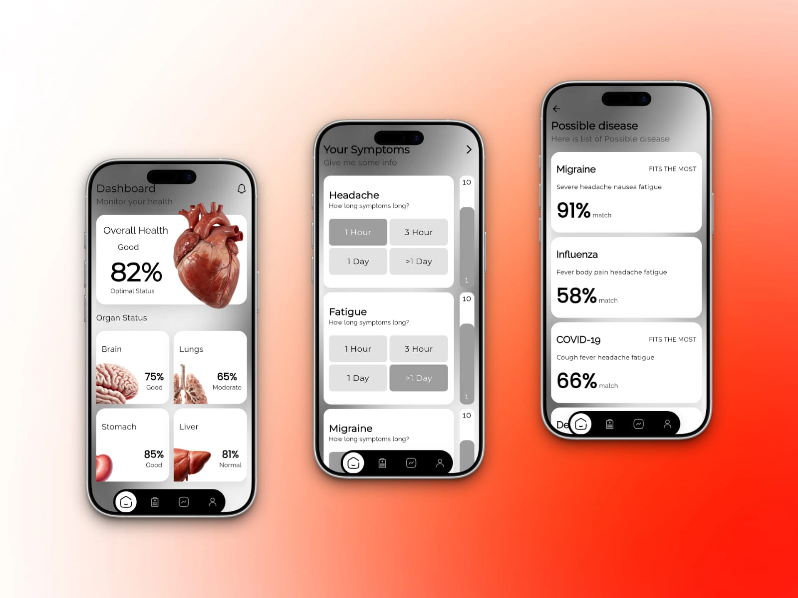

# HealthHub 🏥

A modern, intelligent Flutter application designed to help users understand diseases, symptoms, and general health information with an intuitive and clean interface.


## ✨ Features

- **Smart Disease Explorer** - Browse and learn about various diseases
- **Symptom Checker** - Identify potential health concerns through symptoms
- **Modern UI/UX** - Beautiful, responsive, and user-friendly interface
- **Bottom Navigation** - Smooth navigation experience
- **Modular Architecture** - Clean, scalable, and maintainable codebase

## 🛠 Tech Stack

- **Framework**: Flutter (Dart)
- **Architecture**: Feature-first + Layered Architecture
- **State Management**: [Add your choice - Provider/Riverpod/Bloc]
- **UI**: Custom widgets with consistent design system

## 📱 Screenshots



## 🚀 Getting Started

### Prerequisites

- Flutter SDK (3.0+)
- Dart SDK
- Android Studio / VS Code

### Installation

```bash
# Clone the repository
git clone https://github.com/dartrox404/HealthHub.git

# Navigate to project directory
cd HealthHub

# Install dependencies
flutter pub get

# Run the app
flutter run
```

## 📁 Project Structure

lib/
├── core/ # Core utilities & configurations
│ ├── const/ # App constants
│ ├── extensions/ # Useful extensions
│ └── theme/ # Theme, colors, typography
├── data/ # Data layer
│ ├── model/ # Data models
│ └── routes/ # App routing
├── features/ # Feature-based modules
│ ├── pages/ # Screen pages
│ └── widgets/ # Reusable widgets
└── main.dart

## 🏗 Architecture

This project follows Feature-First Architecture which makes it highly scalable and maintainable for large applications.

## 🤝 Contributing

Contributions are welcome! Feel free to open issues and pull requests.

## 📄 License

This project is licensed under the MIT License.
